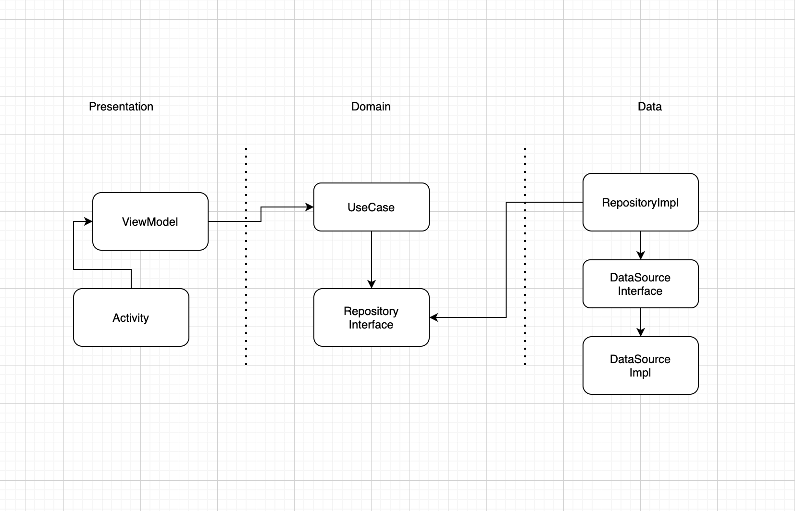

# Money Converter

## How to build and run the project

- Unzip the project
- Is necessary to have the buildToolsVersion "30.0.3".
- Build and run the projet with Android Studio.

## Architectural Approach

I decided to develop this project using a combination of Clean Architecture and MVVM for the presentation layer.

Clean Architecture, because is important to have the business logic isolated, having the code in this way makes it 
easier to develop unit tests and also makes everything more structured since this layer is guided by the use cases.
This way we can also ensure that we have more coverage on the business logic.

MVVM, because is the architectural pattern recommended by the official Android Documentation, using this pattern we can take advantage of using viewmodel.
A good example of this approach is sharing the same instance of a view model between 2 fragments.

## Libraries used or copied code

In the presentation layer I decided to follow an Implementation from [Medium](https://medium.com/androiddevelopers/livedata-with-snackbar-navigation-and-other-events-the-singleliveevent-case-ac2622673150), 
just in order to consume once all the values related with ui stuff.

Some of the libraries I decided to use are: 
 - Koin (Dependency injection framework).
 - Navigation (Component of Android Jetpack).
 - Moshi (A JSON library for kotlin).